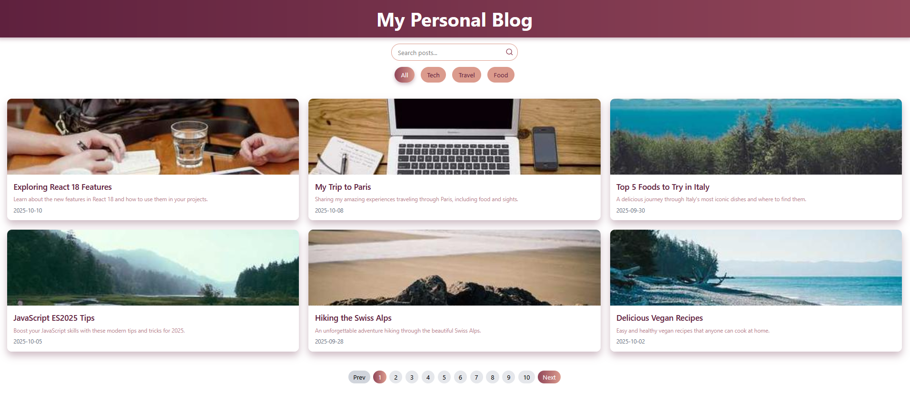

# Elevvo Pathways Front-End Web Development Internship Projects

Welcome to my **Elevvo Pathways Front-End Internship** repository! 🎓💻  
This repository contains 7 projects/tasks completed during my internship, each focusing on key **front-end development skills** including HTML, CSS, JavaScript, React, and responsive design principles.

Each task is contained in its own folder with the relevant code, screenshots, and a README detailing the project.

---

## Internship Overview

During this internship, I gained hands-on experience in:

- Building **responsive layouts** for web applications and landing pages  
- Implementing **interactive UI components** such as sidebars, forms, and dashboards  
- Utilizing **modern front-end tools** like React, Tailwind CSS, and React Router  
- Integrating **APIs** and handling asynchronous data fetching  
- Practicing **component-based architecture** and modular design  
- Creating **user-friendly interfaces** with consistent styling and accessibility in mind  

---

## Projects / Tasks

### Task 1: Collapsible Sidebar
A fully responsive sidebar that toggles open and closed with smooth animations.  
  

### Task 2: Contact Form
A clean, responsive contact form with **validation** and success feedback.  
  

### Task 3: One-Page Website for TaskFlow App
A modern **one-page app website** highlighting features, testimonials, and pricing with smooth scroll animations.  
  
  

### Task 4: Personal Blog Homepage
A responsive **blog homepage** displaying posts in card layout with search, filtering, and pagination functionality.  
  

### Task 5: Responsive Landing Page for a Tech Product
A **SaaS product landing page** with hero, features, testimonials, pricing, and call-to-action sections.  
  
  

### Task 6: Multi-Page Dashboard for a Fictional Freelance Client
A **multi-page admin dashboard** with Overview, Projects, and Profile pages, including charts and reusable components.  
  
  
  

### Task 7: Real-Time Weather Dashboard
A **real-time weather dashboard** fetching data from OpenWeatherMap API, including 3-day forecasts, search, and geolocation.  
  

---

## Tools & Technologies Used Across Projects

- **HTML5 & CSS3** – Structure and styling of all web pages  
- **JavaScript (ES6+)** – DOM manipulation, interactive components, API calls  
- **ReactJS** – Component-based architecture, state management  
- **Tailwind CSS** – Responsive, utility-first styling  
- **React Router** – Client-side routing for multi-page apps  
- **Node.js & Express** – Local server for API handling (Task 7)  
- **Chart.js (React-chartjs-2)** – Data visualization for dashboards  
- **Font Awesome / Lucide React** – Icons for UI elements  
- **Flexbox & CSS Grid** – Layout structuring and responsive design  

---

## Highlights & Skills Developed

- Responsive web design across multiple screen sizes  
- Interactive UI elements: toggles, forms, modals, and charts  
- Component-based development in React  
- API integration and asynchronous JavaScript handling  
- Clean code structure and project organization  
- Hands-on experience with modern front-end workflow and tools  

---

## How to Use This Repository

1. **Clone the repository**  
```bash
git clone https://github.com/yourusername/elevvo-pathways-frontend.git
