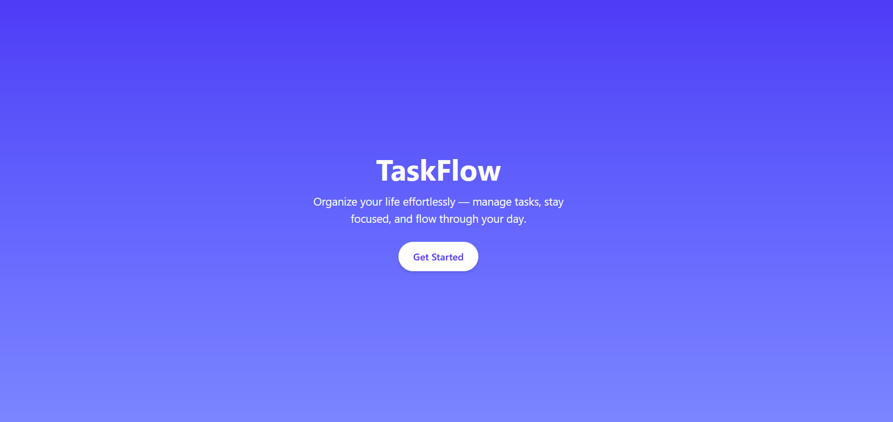
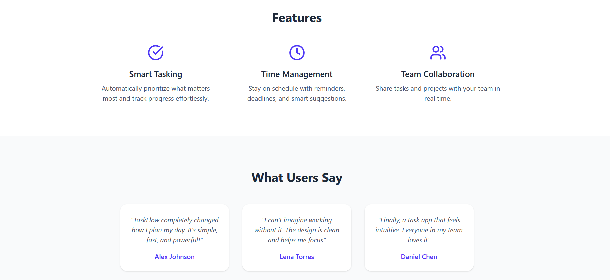

# Task 3: One-Page Website for TaskFlow App




## Description

This project builds a modern one-page website for a fictional task-management app called TaskFlow, a tool that helps people organize and track their daily tasks efficiently.  

The website highlights the app’s key features, user testimonials, and pricing plans, all wrapped in a clean, responsive design with smooth scroll animations as each section appears.

---

## Tools & Technologies Used

- **React + Vite** → Project setup and component structure  
- **Tailwind CSS (@tailwindcss/vite)** → Styling, utility classes, responsive design  
- **JavaScript (ES6+)** → Scroll animation logic  
- **Lucide React** → Icons for features, social links, and UI elements  

---

## Features

- Responsive one-page layout
- Smooth scroll animations as each section enters view  
- Feature section with icons and concise descriptions  
- User reviews with quotes and names  
- Pricing section with three plans: Free, Pro, Team  
- Footer with social-media icons and copyright  
- Minimal, elegant gradient hero section with a “Get Started” button  

---

## How It Works

1. The **Header** introduces the TaskFlow app with a title, short message, and CTA button.  
   - Clicking **Get Started** smoothly scrolls to the Features section.  
2. The **Features** section displays three key capabilities with icons.  
3. The **Reviews** section showcases user feedback in cards.  
4. The **Pricing** section lists subscription plans with a “Choose” button.  
5. The **Footer** includes social links and copyright info.  
6. As you scroll, each section **fades and slides in** using the `IntersectionObserver` logic in `SectionWrapper`.

---

## How to Run

1. **Clone or download** this repository.  
2. Install dependencies:  
   ```bash
   npm install
3. Start the development server:
    ```bash
    npm run dev
4. Open the local URL shown in your terminal (e.g. http://localhost:5173) in your browser.
5. Scroll down to see the smooth section animations in action.

---

Created as part of my front-end learning tasks.