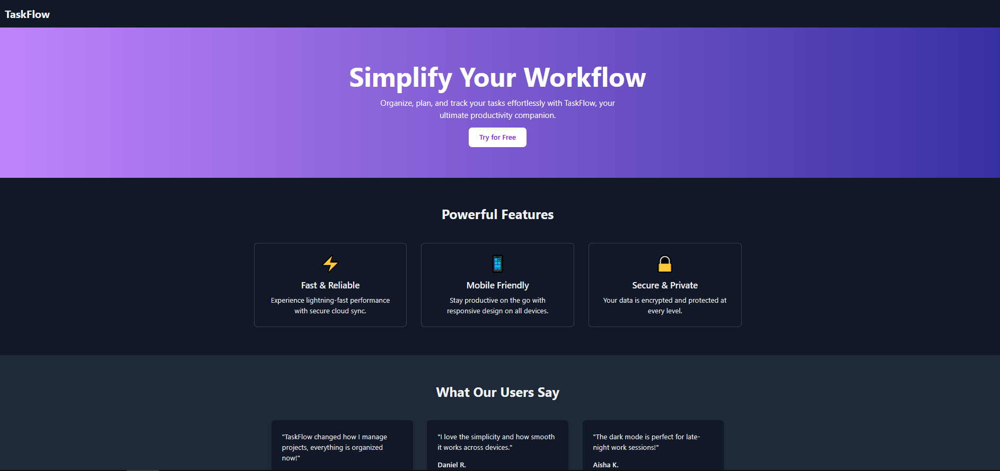

# Task 5: Responsive Landing Page for a Tech Product

## Description

This project implements a **responsive marketing landing page** for a fictional SaaS product called **TaskFlow**; a productivity tool designed to simplify task management and boost efficiency.  

The page includes sections such as **Hero**, **Features**, **Testimonials**, **Pricing**, and a **Call-to-Action**, all built with a modern and clean layout. It’s responsive and adapts smoothly across mobile, tablet, and desktop devices.

---

## Tools & Technologies Used

- **HTML**: Page structure and content organization  
- **CSS**: Core styling and layout control  
- **Tailwind CSS**: Utility-first styling for fast and responsive design  
- **JavaScript**: Interactive behavior and functionality (if needed)  
- **Flexbox & Grid**: For modern and flexible layout arrangements  

---

## Features

- Clean, minimal, and modern landing page design  
- Fully responsive, optimized for desktop, tablet, and mobile  
- Smooth gradient hero section with a clear call-to-action  
- Feature cards with icons and concise descriptions  
- Testimonials section with user feedback  
- Simple and transparent pricing plans  
- Final call-to-action section to encourage conversions 

---

## How It Works

1. The **Hero Section** introduces TaskFlow and includes a main call-to-action button.  
2. The **Features Section** highlights key product advantages in a grid layout.  
3. The **Testimonials Section** showcases positive user feedback for social proof.  
4. The **Pricing Section** presents three pricing tiers: Free, Pro, and Enterprise.  
5. The **Call-to-Action Section** motivates users to start their free trial.  
6. The **Footer** includes basic copyright info.

The design uses **Tailwind’s responsive classes** to ensure a seamless experience on all devices.

---

## How to Run

1. **Clone or download** this repository.  
2. Open the project folder in your code editor.  
3. Run the project by opening `index.html` in your browser.  

No installation or build process is required. It’s a simple static project.

---

Created as part of my front-end learning tasks.
