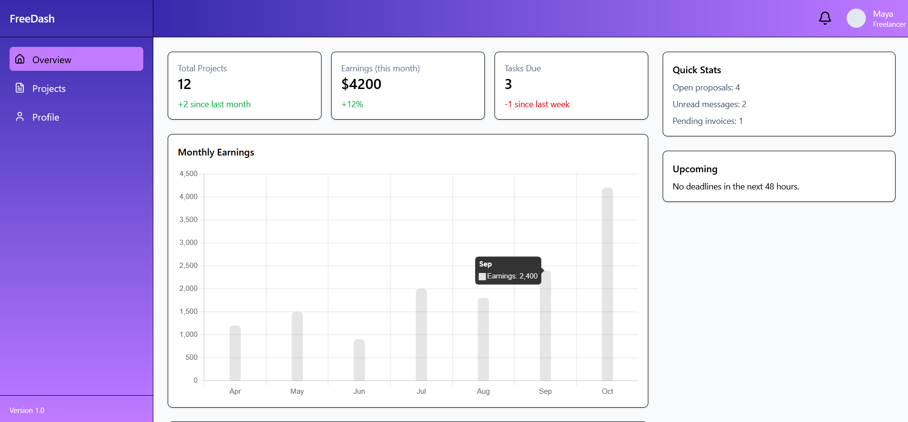
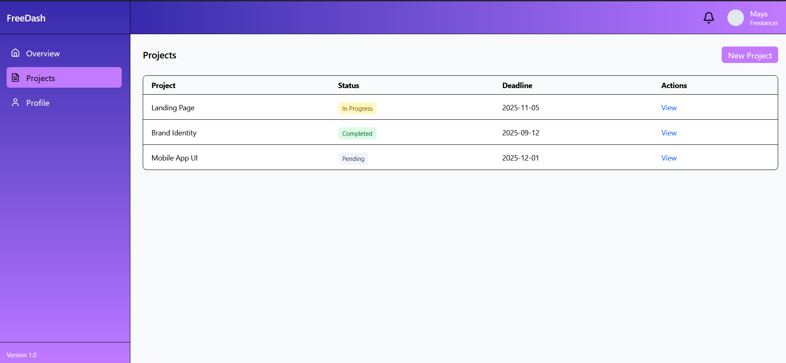

# Task 6: Multi-Page Dashboard for a Fictional Freelance Client





## Description

This project implements a **multi-page admin dashboard interface** for a fictional freelance client named **FreeDash**.  

The dashboard includes three pages: **Overview**, **Projects**, and **Profile Settings**, each designed with a consistent layout featuring a sidebar and top header. Navigation between pages is handled via **React Router**, ensuring a smooth user experience without full page reloads.

This task focuses on building a modular, component-based dashboard with dynamic data display, chart visualizations, and responsive design principles.

---

## Tools & Technologies Used

- **ReactJS**: For component-based UI structure and rendering  
- **React Router**: For client-side routing between pages  
- **Tailwind CSS**: For modern, responsive styling  
- **React-chartjs-2**: For data visualization 
- **Lucide React**: For clean, lightweight icons  
- **Flexbox & Grid**: For fluid and adaptive layouts  

---

## Features

- **Three-Page Dashboard**, Overview, Projects, and Profile Settings  
- **Reusable Components** such as Sidebar, Topbar, SummaryCard, and StatusPill  
- **Charts Integration** using React-chartjs-2
- **Projects Table** displaying project name, status, and deadline  
- **Profile Page** allowing view/edit of basic profile info  
- **Consistent UI** with sidebar and top header on all pages  
- **Responsive Design** optimized for both desktop and mobile  
- **Smooth Routing** between pages without full reloads  

---

## How It Works

1. The **Sidebar** component handles navigation between pages using `NavLink`.  
2. The **Topbar** provides quick access to notifications and the user profile.  
3. The **Overview Page** displays summary cards (Projects, Earnings, Tasks Due) and a bar chart for visual analytics.  
4. The **Projects Page** lists client projects in a table format, each showing project name, status (with color-coded pills), and deadline.  
5. The **Profile Page** allows the user to view/edit personal details such as name, email, and password.  
6. The **Routing System** ensures page transitions occur without reloading the browser.  

---

## How to Run

1. **Clone or download** this repository.  
2. Install dependencies:  
   ```bash
   npm install
3. Start the development server:
    ```bash
    npm run dev
4. Open the local URL shown in your terminal (e.g. http://localhost:5173) in your browser.

---

Created as part of my front-end learning tasks.
